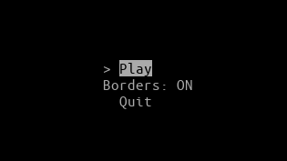
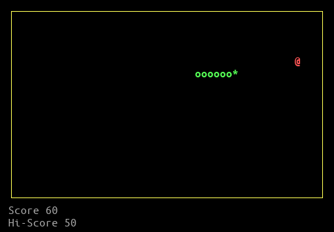

# Snake Game
Terminal snake game implemented in C++.

## Build
Dependencies: [ncurses](https://en.wikipedia.org/wiki/Ncurses)

### macOS
```console
$ brew install pkg-config ncurses
```

### Debian
```console
$ sudo apt install pkg-config libncurses5-dev libncursesw5-dev
```

## Quick Start
```console
$ make -j
$ ./snake
```

## Screenshots
<br>

