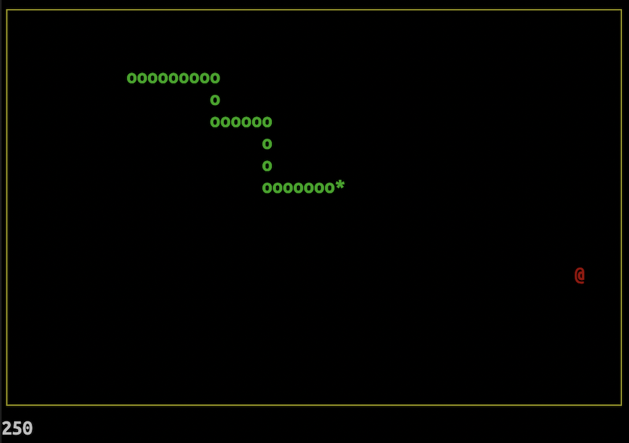

# Snake

Snake game implemented in C++. Rendering is done using [ncurses](https://en.wikipedia.org/wiki/Ncurses) library.

Initially written in 2019.

## Quick Start
```console
$ make
$ ./snake
```

## Screenshots

